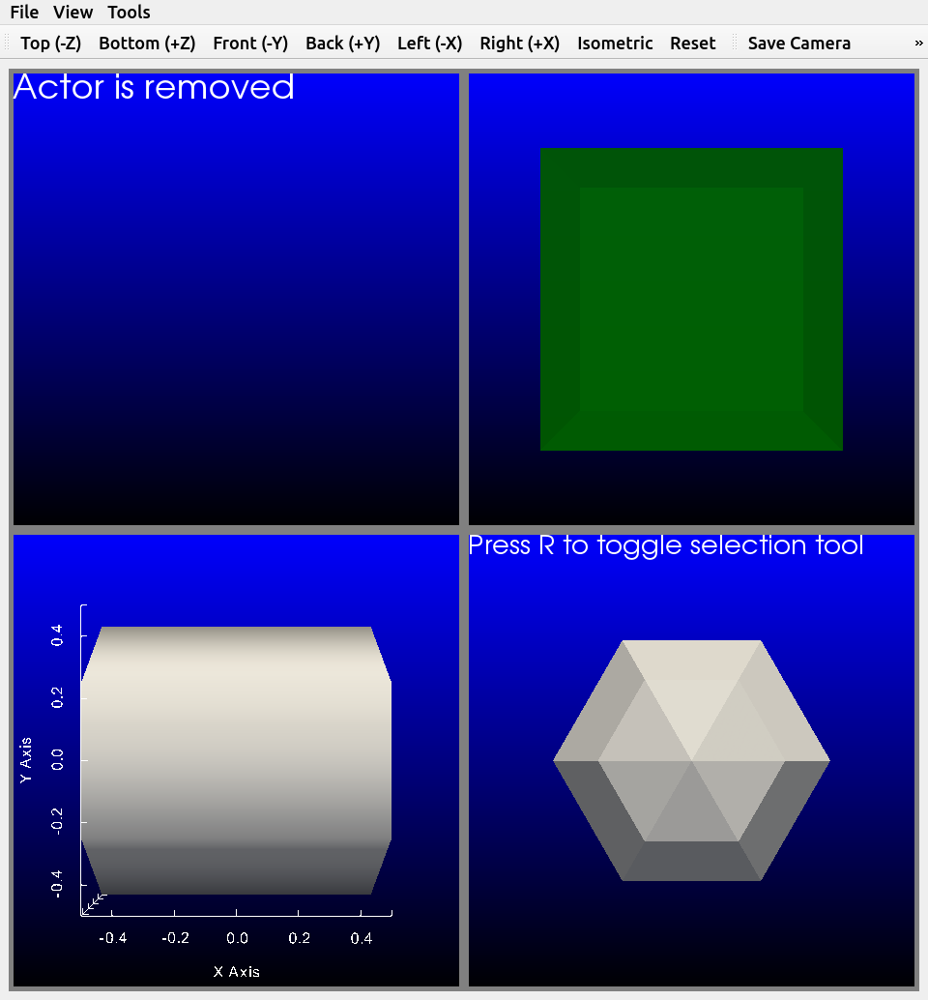

.. title:: pyvistaqt

Overview
********
The python package ``pyvistaqt`` extends the
functionality of ``pyvista`` through the usage of ``PyQt5``.  Since ``PyQt5`` operates in a separate thread than VTK, you can similtaniously have an active VTK plot and a non-blocking Python session.

    pyvistaqt BackgroundPlotter

Getting Started
***************

Installation using ``pip`` is::

    $ pip install pyvistaqt

You can also visit `PyPi <https://pypi.org/project/pyvistaqt/>`_ or
`GitHub <https://github.com/pyvista/pyvistaqt>`_ to download the source.

Brief Example
*************
Create an instance of the ``BackgroundPlotter`` and plot a sphere.

.. code:: python

    import pyvista as pv
    from pyvistaqt import BackgroundPlotter

    sphere = pv.Sphere()

    plotter = BackgroundPlotter()
    plotter.add_mesh(sphere)

.. toctree::
   :maxdepth: 2
   :caption: Introduction
   :hidden:

   qt_plotting

License
=======
While ``pyvistaqt`` is under the MIT license, ``pyqt5`` is subject to
the GPL license.  Please see deails at
`Riverbank License FAQ <https://www.riverbankcomputing.com/commercial/license-faq>`_.
