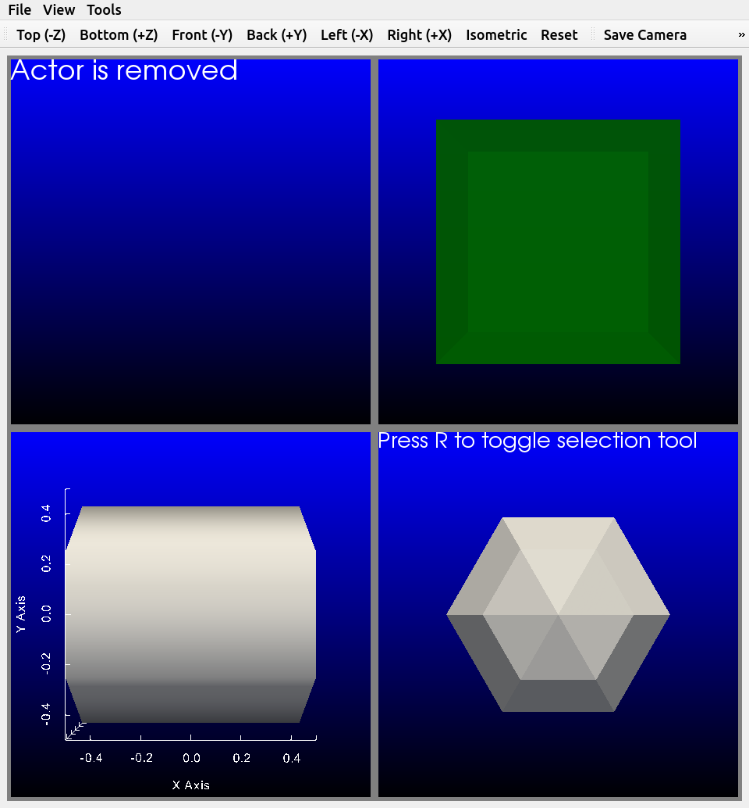

.. title:: pyvistaqt

Overview
********

.. image:: https://img.shields.io/pypi/v/pyvistaqt
   :target: https://pypi.org/project/pyvistaqt/
   :alt: PyPI

.. image:: https://img.shields.io/conda/vn/conda-forge/pyvistaqt
   :target: https://anaconda.org/conda-forge/pyvistaqt
   :alt: conda-forge

.. image:: https://img.shields.io/badge/License-MIT-yellow.svg
   :target: https://opensource.org/licenses/MIT
   :alt: MIT License

The Python package ``pyvistaqt`` extends the
functionality of ``pyvista`` through the usage of *Qt*. 
Since *Qt* applications operate in a separate thread than VTK,
you can simultaneously have an active VTK plot and a non-blocking Python session.

    pyvistaqt BackgroundPlotter

.. toctree::
   :hidden:

   self

Getting Started
***************

Installation using ``pip``::

    $ pip install pyvistaqt

To install this package with ``conda``::

    $ conda install -c conda-forge pyvistaqt

You can also visit `PyPI <https://pypi.org/project/pyvistaqt/>`_ or
`GitHub <https://github.com/pyvista/pyvistaqt>`_ to download the source.

Once installed, use the :class:`pyvistaqt.BackgroundPlotter` like any PyVista
plotter.

Brief Example
~~~~~~~~~~~~~

Create an instance of the :class:`pyvistaqt.BackgroundPlotter` and plot a
sphere.

.. code:: python

    import pyvista as pv
    from pyvistaqt import BackgroundPlotter

    sphere = pv.Sphere()

    plotter = BackgroundPlotter()
    plotter.add_mesh(sphere)

.. important::

   ``pyvistaqt`` embeds VTK through an X11 render window, which cannot draw
   into a native Wayland surface. On a Wayland session it therefore needs the
   XWayland (``xcb``) Qt platform plugin (see
   `issue #445 <https://github.com/pyvista/pyvistaqt/issues/445>`_).

   When ``pyvistaqt`` creates the ``QApplication`` itself, it now selects
   ``xcb`` automatically (unless you pin ``QT_QPA_PLATFORM``). If you create
   the ``QApplication`` yourself, set ``QT_QPA_PLATFORM=xcb`` *before* doing
   so -- otherwise on-screen plotting raises a ``RuntimeError``. The most
   portable way is to set it at the very top of your script:

   .. code:: python

      import os

      os.environ["QT_QPA_PLATFORM"] = "xcb"

      import pyvista as pv
      from pyvistaqt import BackgroundPlotter

.. toctree::
   :maxdepth: 2
   :caption: Getting Started
   :hidden:

   usage
   api_reference

License
*******

``pyvistaqt`` is under the MIT license.
However, Qt bindings have licenses of their own.

``pyvistaqt`` uses ``qtpy`` to abstract over the underlying Qt binding:

> QtPy is a small abstraction layer that lets you write applications using a single API call to either PyQt or PySide.

This means the Qt binding actually installed at runtime (e.g., ``PyQt5``,
``PyQt6``, ``PySide2``, ``PySide6``) determines the license obligations
for the Qt layer of your application. Please refer to the
`QtPy documentation <https://github.com/spyder-ide/qtpy>`_ and the
license of the binding you install to learn more.